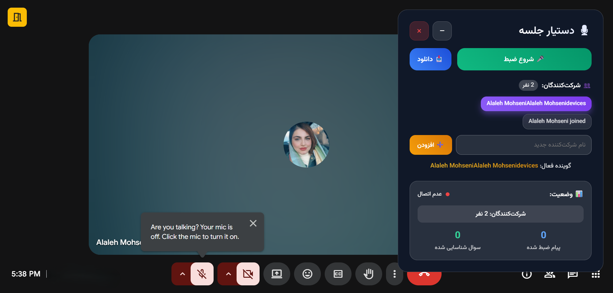
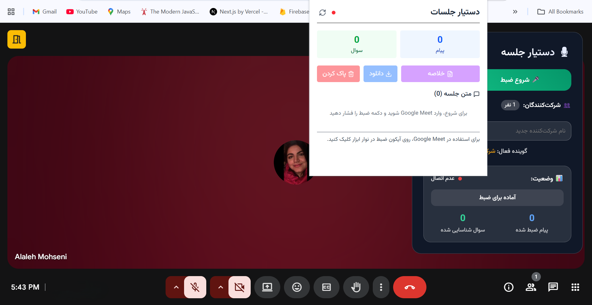

# Persian Meeting Assistant

A sophisticated voice-powered meeting assistant that provides real-time transcription, automatic question detection, and AI-generated summaries in Persian (Farsi). Built with Preact, Node.js, and integrated with Google Cloud Speech-to-Text and OpenAI APIs.

### Extension screenshots

<p align="center">
  
  &nbsp;&nbsp;
  
</p>

## 🌟 Features

- **Real-time Voice Transcription**: Live speech-to-text conversion in Persian using Google Cloud Speech-to-Text API
- **Speaker Diarization**: Automatic speaker identification and management
- **Intelligent Question Detection**: Automatically identifies and highlights questions during meetings
- **AI-Powered Summaries**: Generate comprehensive meeting summaries using OpenAI GPT
- **Multi-speaker Support**: Add, edit, and manage multiple meeting participants
- **Export Functionality**: Download meeting transcripts and summaries
- **Offline Fallback**: Works with browser-based speech recognition when server is unavailable
- **Real-time Processing**: Continuous audio processing with 30-second chunks
- **Browser Extension**: Fully functional as a Chrome/Firefox browser extension
- **Dual Mode Support**: Works as both standalone web app and browser extension

## 🏗️ Architecture

### Backend Components

- **Express.js Server**: RESTful API with middleware for CORS, file upload handling
- **Google Cloud Speech-to-Text**: Advanced Persian language transcription
- **OpenAI Integration**: GPT-powered summary generation
- **Multer**: File upload handling for audio processing
- **Real-time Audio Processing**: Chunked audio processing for continuous transcription

### Frontend Components

- **Preact**: Lightweight React alternative (3KB) with full React compatibility
- **React Hooks Support**: Complete hooks compatibility via preact/compat
- **Lucide Icons**: Clean and consistent iconography
- **Tailwind CSS**: Responsive and modern styling
- **Web APIs**: MediaRecorder, SpeechRecognition for browser-based functionality

### Key APIs

- `POST /api/transcribe` - Audio file transcription with speaker diarization
- `POST /api/detect-questions` - Persian question detection
- `POST /api/generate-summary` - AI-powered meeting summary generation
- `GET /api/health` - Server health check

## 🚀 Quick Start

### Prerequisites

- Node.js 22+
- Docker (optional)
- Google Cloud Speech-to-Text API credentials
- OpenAI API key

### Installation

1. **Clone the repository**

```bash
git clone https://github.com/Alaleh-Mohseni/Meeting-assistant.git
cd Meeting-assistant
```

2. **Install dependencies**

```bash
npm install
```

3. **Environment Setup**
   Create a `.env` file in the root directory:

```env
OPENAI_API_KEY=your_openai_api_key_here
GOOGLE_APPLICATION_CREDENTIALS=path/to/your/google-credentials.json
PORT=5173
```

4. **Google Cloud Setup**

   - Create a Google Cloud project
   - Enable Speech-to-Text API
   - Create service account credentials
   - Download the JSON key file

5. **Start Development Server**

```bash
npm run nodemon
```

The application will be available at `http://localhost:5173`

### Docker Deployment

```bash
# Build and run with Docker Compose
docker-compose up -d
```

## 🔌 Browser Extension

The application can be packaged and used as a browser extension for Chrome, Firefox, and other Chromium-based browsers.

### Building the Extension

1. **Build the extension files**:

```bash
npm run build:extension
```

2. **Package the extension**:

```bash
npm run pack:extension
```

This creates `meeting-assistant-extension.zip` in `dist/extension/` directory.

### Installing the Extension

#### Chrome/Chromium Browsers:

1. Open Chrome and go to `chrome://extensions/`
2. Enable "Developer mode" (toggle in top right)
3. Click "Load unpacked"
4. Select the `dist/extension` folder (or extract and select the zip contents)
5. The extension icon will appear in your browser toolbar

#### Firefox:

1. Go to `about:debugging`
2. Click "This Firefox"
3. Click "Load Temporary Add-on"
4. Select any file from the `dist/extension` folder

### Extension Features

- **Popup Interface**: Clean, responsive UI optimized for browser extension popup
- **Background Processing**: Runs background scripts for continuous functionality
- **Content Script Integration**: Can interact with web pages when needed
- **Offline Capable**: Works without constant server connection using browser APIs
- **Cross-browser Compatible**: Works on Chrome, Firefox, Edge, and other modern browsers

### Extension Files Structure

```
dist/extension/
├── manifest.json         # Extension configuration
├── background.js         # Background script for persistent functionality
├── content.js           # Content script for web page interaction
├── index-extension.html           # Extension popup interface
├── popup.js             # Popup functionality
├── assets/              # Compiled CSS and JS
└── icons/               # Extension icons (16x16, 32x32, 128x128)
```

### Extension Permissions

The extension requests minimal permissions:

- **Microphone**: For audio recording and transcription
- **Active Tab**: To interact with the current webpage (optional)
- **Storage**: To save user preferences and temporary data

## 📋 Usage

### Web Application Mode

1. **Start Recording**: Click the microphone button to begin recording
2. **Manage Speakers**: Add, edit, or remove meeting participants
3. **Real-time Transcription**: View live transcription with speaker identification
4. **Question Detection**: Questions are automatically highlighted
5. **Generate Summary**: Create AI-powered meeting summaries
6. **Export Data**: Download transcripts and summaries as text files

### Browser Extension Mode

1. **Click Extension Icon**: Open the meeting assistant popup
2. **Grant Permissions**: Allow microphone access when prompted
3. **Start Meeting**: Begin recording directly from the popup
4. **Minimal Interface**: Streamlined UI optimized for extension usage
5. **Background Processing**: Meeting continues recording even when popup is closed
6. **Quick Access**: Instant access from any webpage

## 🔧 Configuration

### Audio Settings

- **Sample Rate**: 16kHz (configurable in transcribe.js)
- **Encoding**: WEBM_OPUS (auto-detected)
- **Language**: Persian (fa-IR)
- **Processing Chunks**: 30-second intervals

### Speaker Diarization

- **Default Speakers**: 2 (configurable)
- **Maximum Speakers**: Unlimited
- **Speaker Labels**: Customizable names

### Question Detection Patterns

The system detects Persian questions using:

- Question mark (؟)
- Question words: چی، چه، کی، کجا، چرا، چطور، آیا
- Regular expression patterns for Persian interrogatives

### Extension-specific Settings

- **Popup Size**: 400x600px (optimized for various screen sizes)
- **Background Persistence**: Service worker for Chrome, background page for Firefox
- **Storage**: Local storage for user preferences and temporary meeting data
- **Icon Themes**: Adaptive icons that work with light/dark browser themes

## 📁 Project Structure

```
Meeting-assistant/
├── backend/
│   └── apis/
│       ├── index.js          # API routes aggregation
│       ├── transcribe.js     # Audio transcription endpoint
│       ├── questions.js      # Question detection logic
│       └── summary.js        # AI summary generation
├── src/
│   ├── App.jsx              # Main Preact component
│   ├── App.css              # Component styles
│   ├── index.html           # Web app HTML template
│   ├── index-extension.html # Extension popup HTML template
│   └── server.js            # Express server setup
├── public/
│   ├── manifest.json        # Browser extension manifest
│   ├── background.js        # Extension background script
│   ├── content.js          # Extension content script
│   └── icons/              # Extension icons
├── docker-compose.yml       # Docker configuration
├── vite.config.js          # Vite configuration with extension mode
├── package.json            # Dependencies and scripts
├── .env.example           # Environment variables template
└── README.md              # Project documentation
```

## 🔌 API Reference

### Transcription Endpoint

```http
POST /api/transcribe
Content-Type: multipart/form-data

Parameters:
- audio: Audio file (WebM/WAV/MP3)
- speakerCount: Number of speakers (default: 2)
```

### Summary Generation

```http
POST /api/generate-summary
Content-Type: application/json

{
  "transcript": [...],
  "speakerNames": [...]
}
```

### Question Detection

```http
POST /api/detect-questions
Content-Type: application/json

{
  "transcript": [...]
}
```

## 🛠️ Development

### Available Scripts

- `npm run nodemon` - Start development server with auto-reload
- `npm run dev` - Start Vite development server
- `npm run build` - Build for web application production
- `npm run build:extension` - Build for browser extension
- `npm run dev:extension` - Development mode with extension build watching
- `npm run pack:extension` - Build and package extension as ZIP file

### Extension Development

1. **Start development with extension mode**:

```bash
npm run dev:extension
```

2. **This will**:

   - Start the backend server
   - Build extension files with watch mode
   - Auto-rebuild when source files change

3. **Testing**:
   - Load the unpacked extension from `dist/extension`
   - Changes will be reflected after reloading the extension

## 🤝 Contributing

1. Fork the repository
2. Create a feature branch (`git checkout -b feature/amazing-feature`)
3. Commit your changes (`git commit -m 'Add amazing feature'`)
4. Push to the branch (`git push origin feature/amazing-feature`)
5. Open a Pull Request

### Development Guidelines

- Follow Persian language conventions for UI text
- Maintain RTL (Right-to-Left) text direction
- Test with various Persian accents and dialects
- Ensure mobile responsiveness
- Test both web app and extension modes
- Follow extension store guidelines for submissions

## 📊 Performance

- **Real-time Processing**: < 2 second latency for transcription
- **Audio Chunk Size**: 30 seconds for optimal processing
- **Memory Usage**: Efficient with chunked processing
- **Bundle Size**: Preact keeps bundle size under 150KB
- **Extension Performance**: Minimal background resource usage
- **Offline Capability**: Browser-based fallback when server unavailable

## 🔐 Security

- No audio data stored permanently on server
- Temporary file cleanup after processing
- API key validation for external services
- CORS protection for cross-origin requests
- Extension permissions follow principle of least privilege
- No sensitive data stored in extension local storage

## 🐛 Troubleshooting

### Common Issues

**Microphone Permission Denied**

- Ensure browser microphone permissions are granted
- Check HTTPS requirement for audio access
- In extension: grant microphone permission in popup

**Transcription Not Working**

- Verify Google Cloud credentials
- Check API quotas and billing
- Ensure Persian language model availability

**Summary Generation Fails**

- Validate OpenAI API key
- Check API usage limits
- Verify internet connection

**Docker Issues**

- Ensure user permissions (UID 1000)
- Check port availability (5173, 24678)
- Verify volume mounts

**Extension Issues**

- Reload extension after code changes
- Check browser console for errors
- Verify manifest.json is valid
- Ensure all required files are in dist/extension

### Browser-Specific Issues

**Chrome**

- Use Manifest V3 format (already implemented)
- Service worker background script

**Firefox**

- Background page instead of service worker
- Different permission handling

## 📱 Platform Support

### Web Application

- ✅ Chrome 80+
- ✅ Firefox 75+
- ✅ Safari 14+
- ✅ Edge 80+

### Browser Extension

- ✅ Chrome/Chromium (Manifest V3)
- ✅ Firefox (Manifest V2/V3)
- ✅ Edge
- ✅ Opera
- ⚠️ Safari (requires conversion to Safari Web Extension)

## 📄 License

This project is licensed under the MIT License - see the [LICENSE](LICENSE) file for details.

## 🙏 Acknowledgments

- Google Cloud Speech-to-Text for Persian language support
- OpenAI for advanced summary generation capabilities
- Preact team for the lightweight React alternative
- Persian NLP community for language processing insights
- Browser extension development community

## 📞 Support

For support, please open an issue on GitHub or contact [alalamohseni@gmail.com](mailto:alalamohseni@gmail.com)

---

**Made with ❤️ for the Persian-speaking community**
